# 🌿 Plant Image Classification Model
   ### Gourd Family Plant
## 📌 A. Project Overview

### 📖 Brief Description
This project focuses on designing, training, evaluating, and documenting an **image classification model** that can recognize **20 related plant species**. The model was created using **Google Teachable Machine**, where a dataset of plant images was collected, organized into classes, and trained to accurately classify plant species based on visual features such as leaves, flowers, fruits, and overall plant structure. The entire process, including dataset preparation, model evaluation, and testing results, is documented using **GitHub**.

### 🎯 Purpose 
The purpose of this model is to:
- Automatically identify and classify different plant species using images
- Demonstrate the application of machine learning in plant recognition
- Improve skills in dataset handling, model training, and evaluation using accuracy metrics

---

## 🌱 B. Plant Species Section

The following plant species were included in the dataset:

Belong to **GOURD FAMILY PLANT** or the **_Cucurbitaceae_.**

It is a group of mostly vining plants that usually grow creeping or climbing and produce large fruits with seeds inside. Many members are important vegetables and fruits, especially in tropical and warm climates.

| Plant | Scientific Name | Short Description | Image | 
|------|-----------------|------------------|-------------------|
| Cucumber | _Cucumis sativus_ | A climbing or creeping vine plant that produces long green fruits commonly eaten fresh or pickled. | 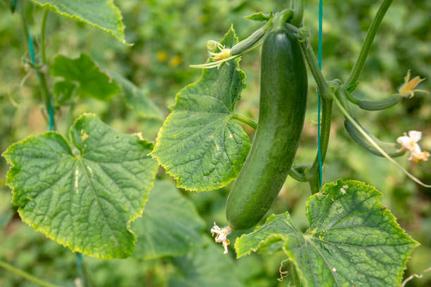 |
| Watermelon | _Citrullus lanatus_ | A spreading vine plant known for its large round or oval fruit with sweet red flesh and high water content. |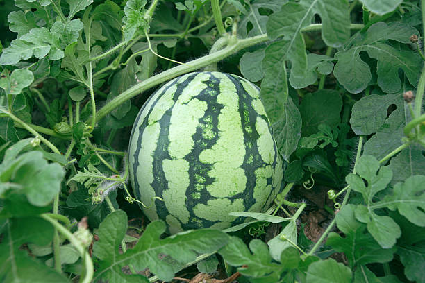 |
| Cantaloupe | _Cucumis melo_ | A vine plant that produces sweet, orange-fleshed melon fruit with a netted rind, commonly eaten fresh. |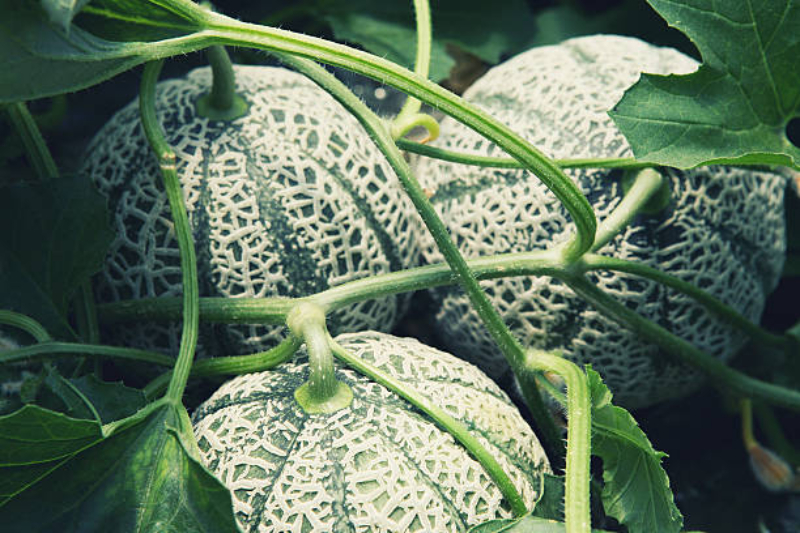 |
| Pumpkin | _Cucurbita pepo_ | A creeping vine plant that produces large orange fruits commonly used for cooking, soups, and desserts. | 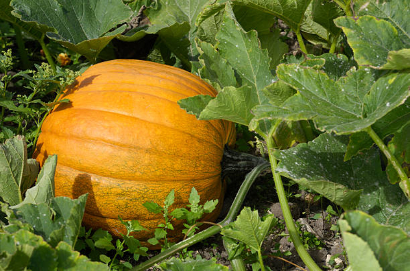 |
| Calabaza | _Cucurbita moschata_ | A squash variety with thick flesh and sweet flavor, widely used in stews and traditional dishes. | 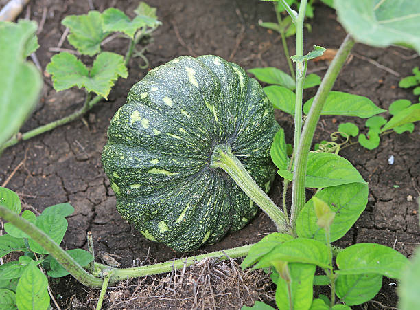 |
| Zucchini | _Cucurbita pepo_ | A summer squash plant that produces smooth green cylindrical fruits often cooked or eaten fresh. | 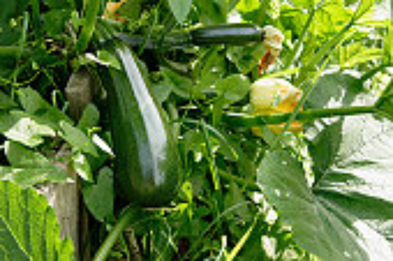 |
| Bitter Melon | _Momordica charantia_ | A climbing vine known for its bumpy green fruit with a bitter taste, commonly used in medicinal and Asian dishes. | 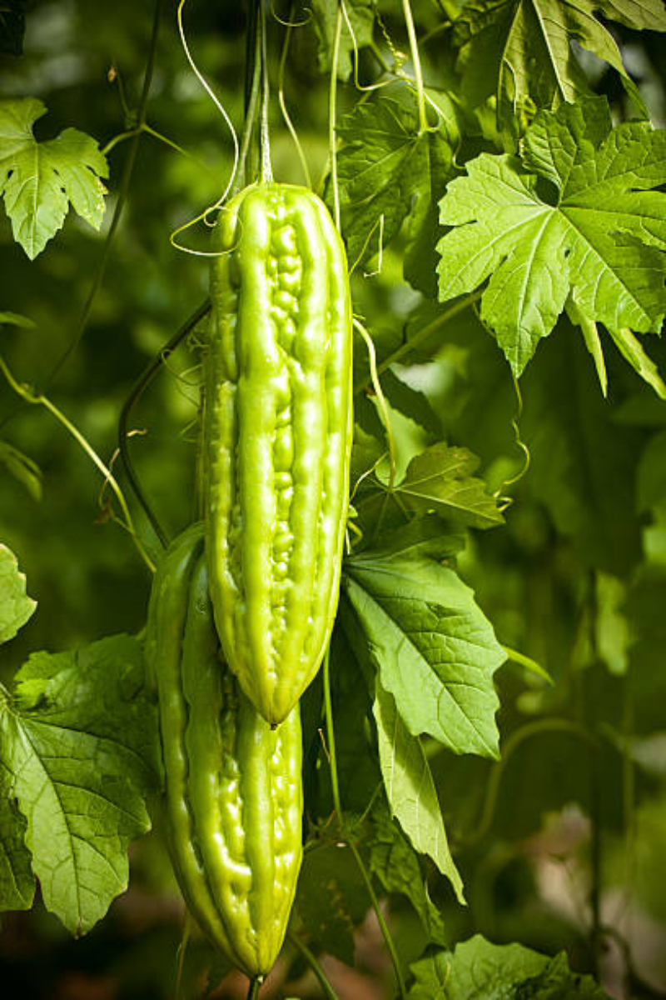 |
| Bottle Gourd | _Lagenaria siceraria_ | A vine plant producing large bottle-shaped fruits, used as a vegetable when young or as containers when dried. | 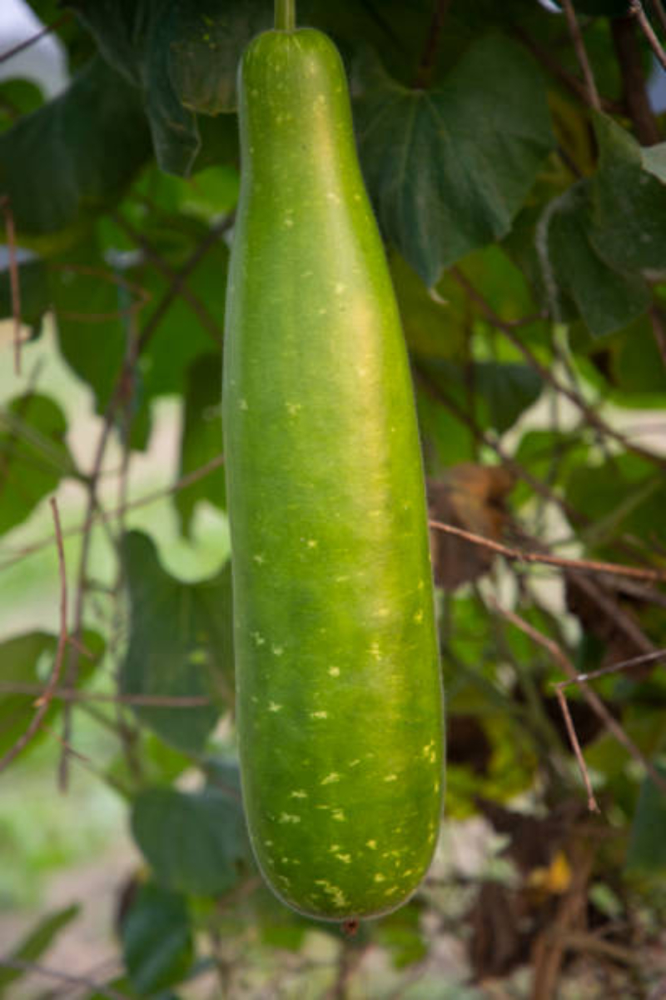 |
| Sponge Gourd | _Luffa aegyptiaca_ | A climbing vine whose mature fruit dries into a fibrous sponge, also eaten as a vegetable when young. | 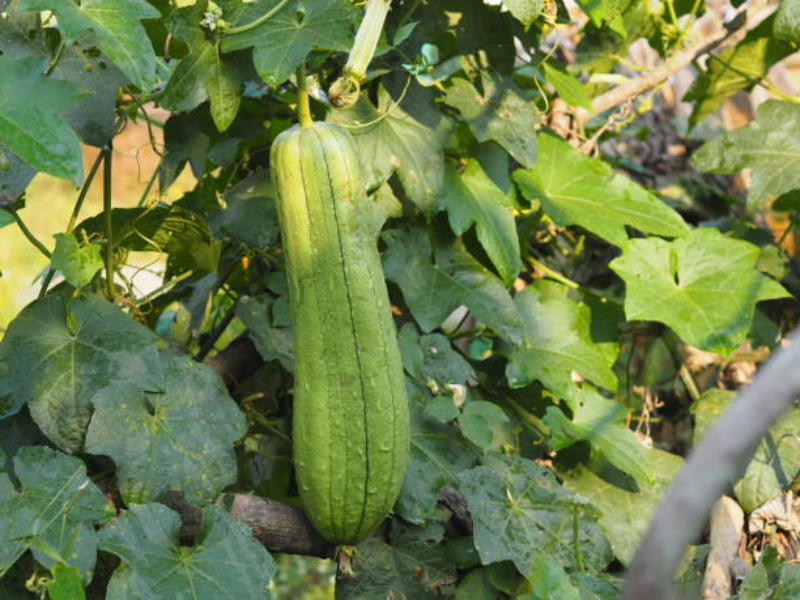 |
| Ridge Gourd | _Luffa acutangula_ | A vine plant producing long ridged fruits, commonly cooked in soups and stir-fry dishes. | 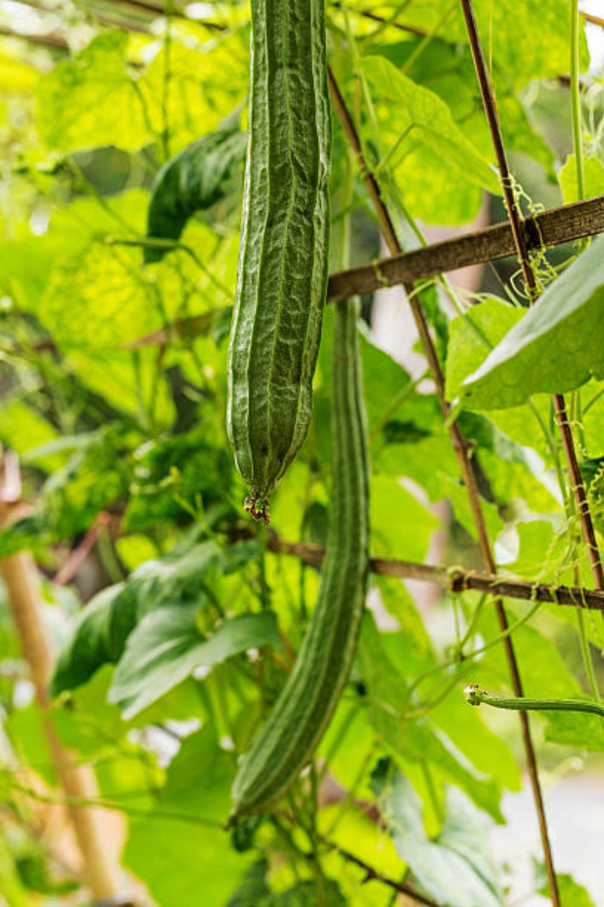 |
| Chayote | _Sechium edule_ | A climbing plant producing pear-shaped green fruits with mild flavor, often used in soups and salads. | 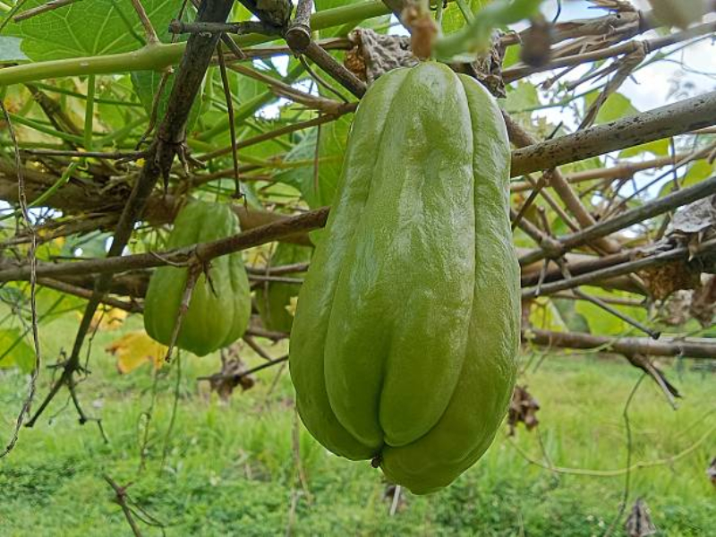 |
| Winter Melon | _Benincasa hispida_ | A vine plant that produces large waxy fruits with pale flesh, commonly used in soups and drinks. | 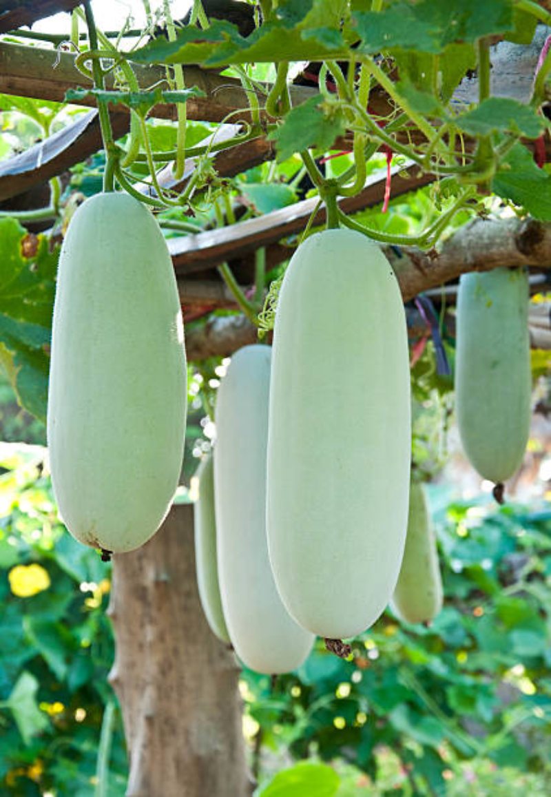 |
| Ivy Gourd | _Coccinia grandis_ | A fast-growing climbing plant producing small green fruits, often cooked as a vegetable in tropical regions. |  |
| Snake Gourd | _Trichosanthes cucumerina_ | A vine plant producing long twisting fruits resembling a snake, usually cooked when young. | 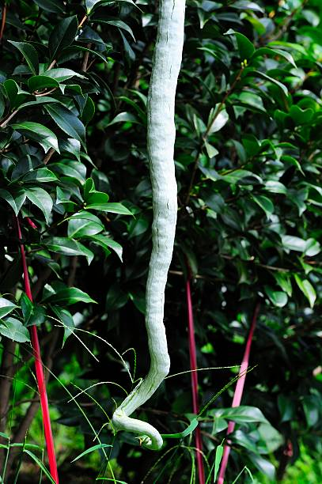 |
| Cucamelon | _Melothria scabra_ | A small vine plant producing grape-sized fruits that look like mini watermelons and taste like cucumber with citrus. | 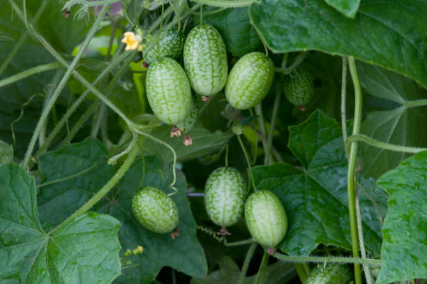 |
| Butternut Squash | _Cucurbita moschata_ | A squash plant producing tan, bell-shaped fruits with sweet orange flesh, popular for roasting and soups. | 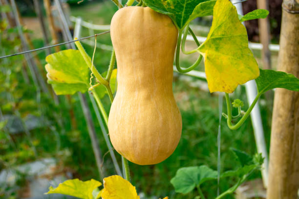 |
| Teasel Gourd | _Momordica subangulata_ | A climbing vine producing spiny fruits, commonly eaten in Southeast Asia and valued for its nutritional benefits. | 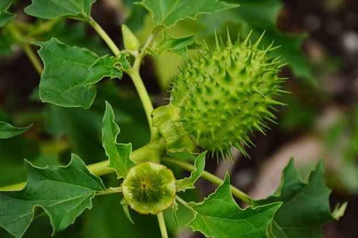 |
| Acorn Squash | _Cucurbita pepo_ | A squash plant producing small ribbed fruits with hard skin and sweet yellow-orange flesh. | 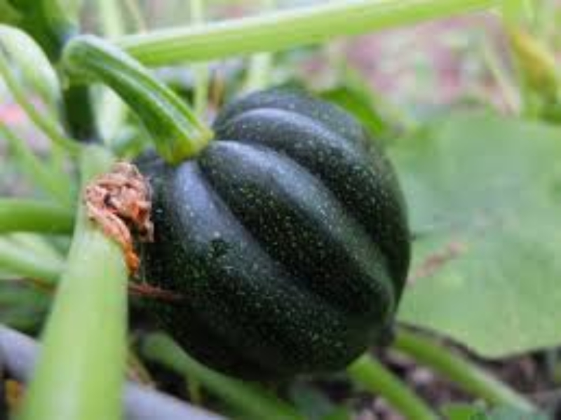 |
| Pattypan Squash | _Cucurbita pepo_ | A summer squash plant producing flat, round fruits with scalloped edges, often cooked or stuffed. | 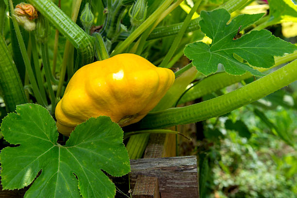 |
| Horned Melon | _Cucumis metuliferus_ | A vine plant producing spiky orange fruits with jelly-like green flesh, known for its refreshing taste. | 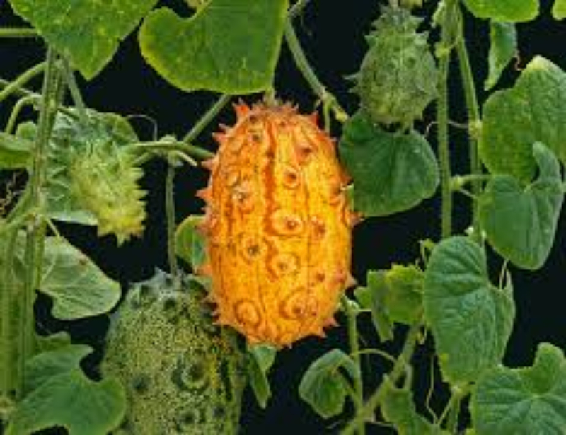 |

---

## ⚙️ C. Model Training Details

The model was trained using the following parameters:

- **Epochs:** `50`
- **Batch Size:** `16`
- **Learning Rate:** `0.001`
- **Number of Images per Class:** `Minimum of 250`

### 📂 Dataset Summary

| Plant Species / Class | Number of Images |
|----------------------|------------------|
|Cucumber | 250 |
|Watermelon | 292 |
| Cantaloupe | 313 |
| Pumpkin | 288 |
| Calabaza | 264 |
| Zucchini | 274 |
| Bitter Melon | 281 |
| Bottle Gourd | 253 |
| Sponge Gourd | 268 |
| Ridge Gourd | 263 |
| Chayote | 267 |
| Winter Melon | 278 |
| Ivy Gourd | 276 |
| Snake Gourd | 262 |
| Cucamelon | 269 |
| Butternut Squash | 276 |
| Teasel Gourd | 289 |
| Acorn Squash | 280 |
| Pattypan Squash | 272 |
| Horned Melon | 269 |

---

## 📊 D. Model Evaluation
- Confusion matrix
- Accuracy per class
- Overall model accuracy
---

## 🧪 E. Model Testing

Below are **10 testing screenshots** taken from the Preview section:

### 🔍 Testing Results Screenshots

1. 
2. 
3. 
4. 
5. 
6. 
7. 
8. 
9. 
10. 

📌 *All screenshots are saved inside the `screenshots/` folder.*

---

# 📝 Reflection Questions

### 1. How did the number of images per class affect your model’s accuracy?

---

### 2. Which plant species were most commonly misclassified and why?

---

### 3. How did changing the epochs, batch size, or learning rate affect the training results?

---

### 4. What challenges did you encounter during dataset collection and labeling?

---

### 5. If you were to improve your model, what specific changes would you make and why?
